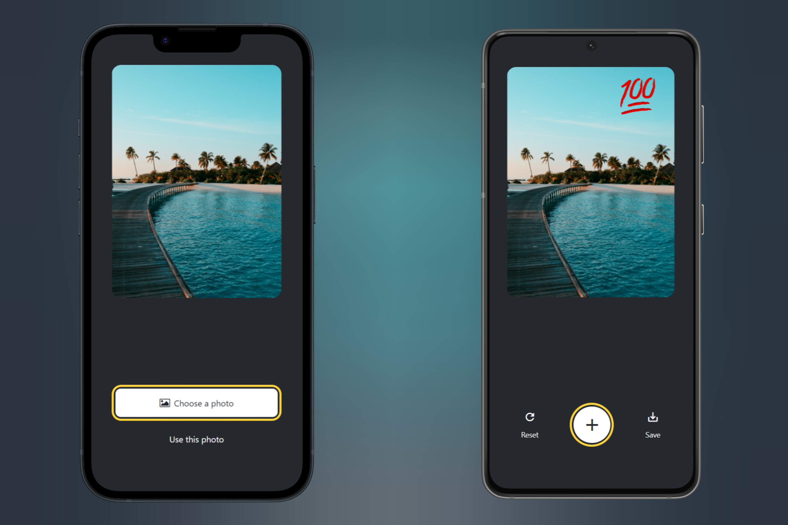

# Sticker Smash

> Sticker Smash is a cross platform application for Android, IOS, and Web Browser built with React Native & Expo.



Sticker Smash is a cross platform application for Android, IOS, and Web Browser built with React Native & Expo that allows users to edit photos and add stickers to it.

<!-- toc -->

- [Features](#features)
- [Usage](#usage)
  - [Install Dependencies](#install-dependencies)
  - [Run](#run)

<!-- tocstop -->

## Features

- Edit photo
- Add sticker to photo
- Save photo on device

## Usage

- You should have node.js installed [Node.js](https://nodejs.org)

### Install Dependencies

Open a terminal

```
npm install
```

### Run

Open a terminal

```
npx expo start
```
